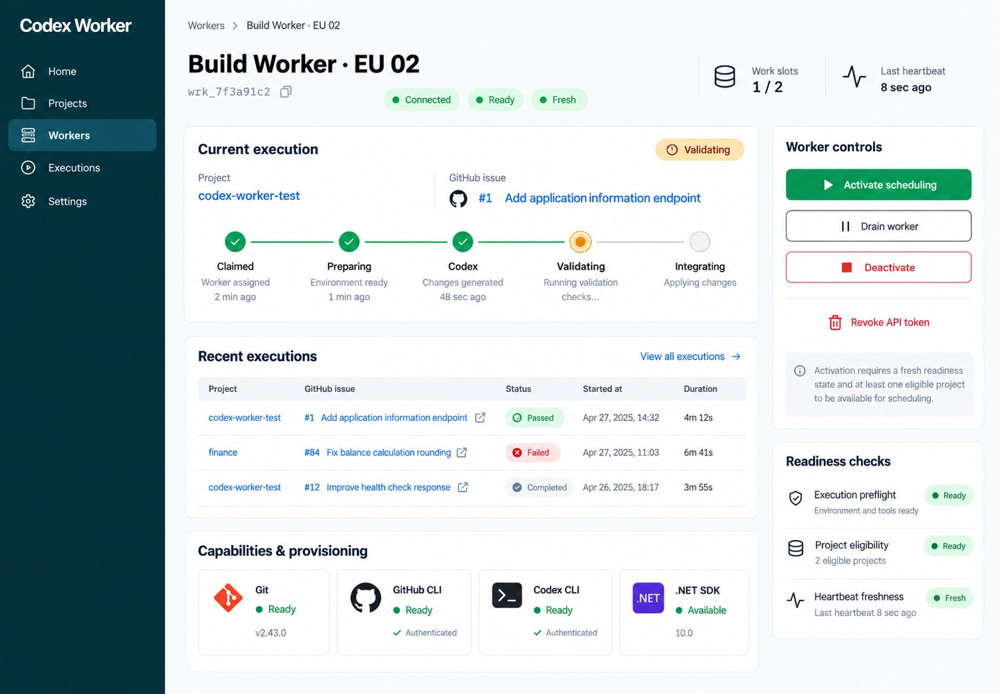
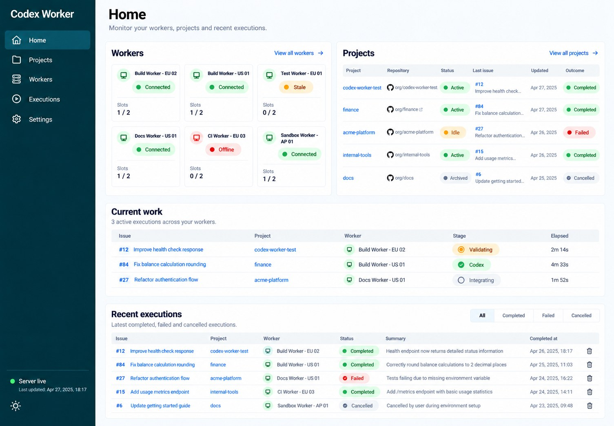

# Administration dashboard design guide

This is the approved direction for future Server administration-dashboard changes,
not a claim that all requirements below are already implemented. It is self-contained;
no external conversation or screenshot is required. The standalone Worker dashboard
retains its existing scope. See [navigation](server-dashboard-navigation.md) for
routes and [React architecture and build](server-dashboard-react.md) for implementation seams.

## Approved visual references

These repository images are the approved visual targets for the initial dashboard redesign. Use them alongside the screen-specific requirements below. Match hierarchy, density, alignment, component treatment and overall look while preserving the real API contracts and data states.

### Worker detail

### Home

### Workers list

The Workers list visual reference is available at
[Workers list reference](dashboard-design/workers-list-reference.md). It grounds
the future list screen in the API's connection, freshness, readiness, capacity and
active-project fields; it is a design artifact, not an implemented screen.

Executions list and detail references are available at
[Executions visual references](dashboard-design/executions-reference.md). They map
the proposed hierarchy and state treatments to the current execution API; they are
design artifacts, not implemented screens.

## Foundation and hierarchy

Use the established React + Untitled UI application in
`src/CodexServer/worker-poc` (the directory name is historical). Reuse its shared
shell, components, tokens, icons, dialogs, theme preferences and API/session hooks.
The existing Worker detail screen at `/workers/{id}` is the visual foundation:
clear page and section headings, concise operational summaries, prominent current
work, and advanced diagnostics on demand. Keep IDs, capability evidence and detailed
technical fields in secondary details. Preserve existing operational actions and safeguards.

Keep connection, execution readiness, scheduling policy, execution state and data
freshness distinct. A connected Worker can be not ready; an idle Worker can be ready;
a stale observation cannot establish current availability. Present the existing
contracts rather than inventing lifecycle rules. Raw API payloads and repetitive
diagnostics must not dominate normal screens.

## Home

On wide screens, place **Workers** and **Projects** side by side at the top:

- **Workers:** compact cards showing name, textual status and occupied/total execution
  slots, with links to Worker detail. Reuse the existing capacity projection; do not
  conflate occupied slots with Server assignments or unknown capacity with zero.
- **Projects:** the five most recently active Projects, ordered by latest recorded
  execution activity. Each entry shows name, external GitHub repository link, textual
  status, and latest execution with Issue name, date and outcome. Link to project and
  execution details and provide access to all Projects. Explicitly identify Projects
  with no recorded execution activity rather than inventing a latest execution.

Below these panels, show **Current executions** with a count and list, followed by
**Recent completed executions** with a status filter. Entries identify the project,
Issue, current state or terminal outcome, and relevant time. Reuse existing execution
state/filter contracts and preserve distinct terminal outcomes. Label counts/lists
limited to a bounded API result; a partial window is not a global total or complete history.

Use Issue names when supplied by an authorized API. If titles, dates, outcomes or
other requested fields are unavailable, show an explicit unavailable value or known
Issue number/link. Never fabricate titles, progress, completion or timestamps. Reuse
existing API contracts and projections; any needed contract extension belongs at its
owning boundary, not in a separate frontend registry or request flow.

## Shared interactions and shell

- Use recognizable sun/moon icons for theme selection, trash for deletion and
  external-link icons for external destinations. Give icon-only controls accessible
  names; use the existing deletion confirmation flow.
- Make status chips comfortably readable with adequate text size, contrast, padding
  and spacing. Pair color with status text; never rely on color alone.
- Keep Server **live/offline** state and **last-updated time** visible in the sidebar.
  Distinguish connection from readiness and individual observation freshness. Show
  unknown time explicitly; failed refreshes must not advance the last successful update.
- Prefer dark mode initially; let users choose a persistent light/dark theme through
  the existing preference store. Use shared tokens consistently in both themes.
- Reuse navigable resource links and existing pending/action/error components and patterns.

## Responsive, data and accessibility states

On narrow screens, stack Workers then Projects, followed by the execution sections.
Allow cards and rows to wrap without hiding essential status, capacity or actions.
Use existing mobile navigation and keep Server connection/update information
discoverable there. Adapt tables to lists or contained horizontal scrolling without
page-wide overflow.

Provide distinct section-level loading, empty, stale and error states. Loading is
not zero Workers or no executions. Empty states explain missing records and offer
relevant existing actions where available; no filter matches differs from no history.
Failed reads show an actionable error/retry state. Retained observations remain
visibly stale with their timestamp. Absent values stay unknown rather than becoming
healthy, zero or successful.

Use semantic headings, lists/tables, labelled inputs and real buttons/links. Support
keyboard operation, visible focus, readable contrast in both themes, usable targets,
narrow widths and zoom. Preserve shared dialog focus containment, Escape dismissal
and focus restoration. Make loading/errors and meaningful status changes accessible
without moving focus or announcing every live refresh. Give external links descriptive
names and indicate their destination behavior.
