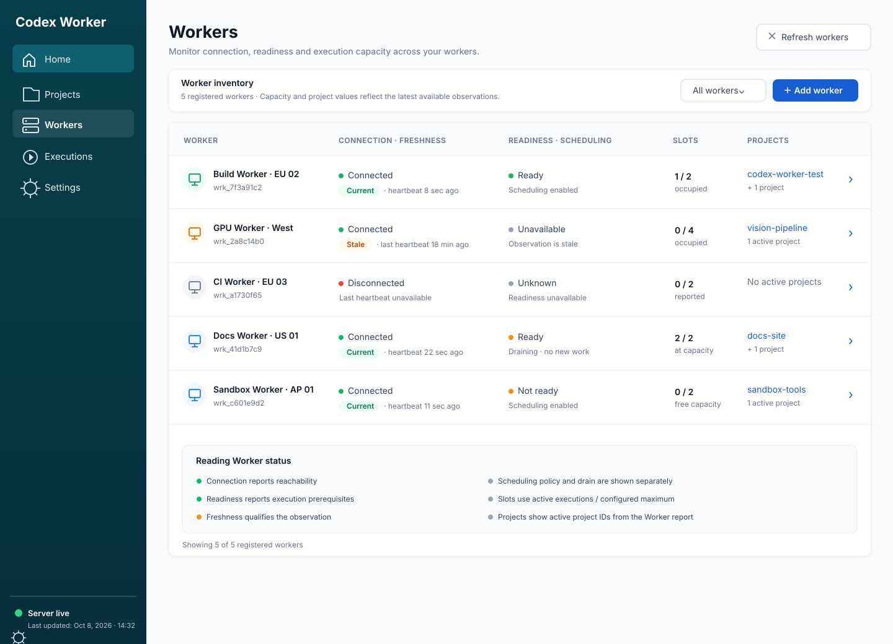

# Workers list visual reference

The list is organized around the operator's scan path: Worker identity and detail
link, connection plus observation freshness, execution readiness plus scheduling
policy, occupied/maximum slots, and active project context. Connection, readiness,
freshness, and draining are separate signals. Unknown or stale observations remain
explicit; a stale node observation does not imply a disconnected Worker. The example
values illustrate combinations supported by the current API and are not live data.

At narrower widths, retain the same information order and let each row wrap into a
stacked Worker card. Keep the detail link and status/capacity visible without
page-wide horizontal scrolling; the sidebar uses the existing mobile navigation.

The current Worker projection provides `displayName`, `workerId`, `availability`,
`lifecycleState`, `schedulingPolicy`, `activeExecutions`, `maximumCapacity` (or
`capacity`), `lastHeartbeatAtUtc`, and `activeProjects`. The node projection adds
`executionReadiness` and `observationsStale`. Project context is therefore shown as
reported active project IDs, not resolved names. The APIs do not provide a
per-project readiness summary on this screen, and readiness/freshness is unavailable
when node observations are absent. Keep those values unknown instead of inferring
them from connection or capacity.
